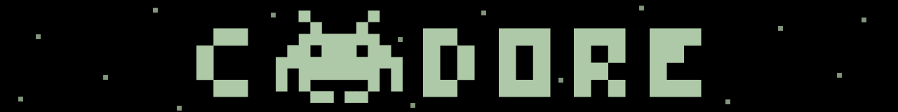

<div align="center">

[](https://github.com/mzpkdev/cmdore/blob/master/LICENSE)
[](https://www.npmjs.com/package/cmdore)
[](https://www.typescriptlang.org/)
[](https://bundlephobia.com/result?p=cmdore)

</div>
<br>
<br>

<p align="center">
  
  <p align="center">
    <strong>cmdore</strong> is a lightweight, type-safe, and composable CLI framework <br>  
      — designed for modern TypeScript applications
    <br />
    <br />
    <a href="#how-to-use"><strong>Explore the API »</strong></a>
    <br />
    <br />
    <a href="https://github.com/mzpkdev/cmdore/issues">Report a bug</a>
    &nbsp;&nbsp;·&nbsp;&nbsp;
    <a href="https://github.com/mzpkdev/cmdore/issues">Request a feature</a>
    &nbsp;&nbsp;·&nbsp;&nbsp;
    <a href="./README_ZH.md">中文</a>
  </p>
<br />
<br />

Table of Contents
------------------

* [Overview](#overview)
  * [Why cmdore?](#why-cmdore)
  * [Key Features](#key-features)
* [Getting started](#getting-started)
  * [How to install](#how-to-install)
  * [How to use](#how-to-use)
  * [How to validate and parse](#how-to-validate-and-parse)
  * [Using with Zod (or any schema library)](#using-with-zod-or-any-schema-library)
  * [How --quiet & --verbose works](#how---quiet----verbose-works)
  * [How --dry-run works](#how---dry-run-works)
  * [How --json works](#how---json-works)

Overview
--------

### Why cmdore?

cmdore is a modern CLI framework that stands out with its perfect balance of simplicity, type safety, and flexibility. Unlike other CLI frameworks that are either too minimal or too opinionated, cmdore provides:

* **True TypeScript-first design**: Built from the ground up with TypeScript, offering complete type safety and excellent IDE integration
* **Composable architecture**: Define commands and options in separate modules for maximum reusability
* **Minimal dependencies**: Extremely lightweight with only two small dependencies
* **Developer-friendly API**: Intuitive API that feels natural to TypeScript developers
* **Progressive complexity**: Simple for basic use cases, but scales to complex CLI applications

### Key Features

* **Advanced Type Safety**: Enjoy full type inference for commands, options, and arguments with zero type assertions needed
* **Modular Command Structure**: Create reusable command and option modules that can be shared across your application
* **Smart Output Control**: Built-in support for quiet, verbose, JSON, and dry-run modes with minimal code
* **Interactive Prompts**: Easily create interactive CLI experiences with built-in prompt utilities
* **Automatic Help Generation**: Beautiful, automatically generated help text for all commands
* **Powerful Validation**: Validate and transform command arguments with a single `validate` function
* **Minimal Bundle Size**: Extremely small footprint with just two lightweight dependencies
* **Interceptors**: Add cross-cutting concerns like authentication or logging across multiple commands
* **Structured Error Handling**: Consistent error handling for validation and runtime errors
* **Zero Configuration**: Works out of the box with sensible defaults, but fully customizable

Getting started
----------------

### How to install

```shell
npm install cmdore
```

### How to use

Learn how to create and register commands with cmdore:

#### 🎮 Basic Command

Start your Space Defender mission with a simple command:

```typescript
const app = new Program();

const startMissionCommand = {
  name: "start-mission",
  description: "Launch your Space Defender spacecraft",
  options: [
    { name: "pilot", description: "Pilot callsign" },
    { name: "difficulty", description: "Mission difficulty" }
  ],
  run: ({ pilot, difficulty }) => {
    console.log(`Attention ${pilot || 'Cadet'}! Launching spacecraft in ${difficulty || 'Standard'} difficulty.`);
    console.log(`Prepare to defend Earth from the alien invasion!`);
  }
};

app.register(startMissionCommand).execute(process.argv.slice(2));
```

#### 🕹️ Helper Functions

Configure your spacecraft systems before engaging the alien fleet:

```typescript
const configureShipCommand = defineCommand({
  name: "configure-ship",
  description: "Prepare your spacecraft for the upcoming battle",
  examples: [
    "--weapons photon-torpedoes --shield quantum"
  ],
  options: [
    defineOption({
      name: "weapons",
      description: "Weapon system to equip",
      alias: "w",
      required: true
    }),
    defineOption({
      name: "shield",
      description: "Shield technology to deploy",
      alias: "s",
      required: true
    })
  ],
  run: ({ weapons, shield }) => {
    console.log(`Arming spacecraft with ${weapons} weapon systems`);
    console.log(`Activating ${shield} shields at maximum capacity`);
    console.log(`All systems ready. Prepare for alien encounter!`);
  }
});

app.register(configureShipCommand).execute(process.argv.slice(2));
```

### How to validate and parse

Scan for alien vessels in the sector and validate their threat level:

```typescript
const scanSectorCommand = defineCommand({
  name: "scan-sector",
  description: "Scan space sector for alien activity",
  options: [
    defineOption({
      name: "power",
      description: "Scanner power level (must be between 1.0 and 10.0)",
      alias: "p",
      validate: (value) => {
        const power = parseFloat(value);
        if (isNaN(power) || power < 1.0 || power > 10.0) return false;
        return power;
      }
    }),
    defineOption({
      name: "coordinates",
      description: "Sector coordinates (comma-separated: x,y)",
      alias: "c",
      validate: (value) => value.split(',').map(coord => parseInt(coord.trim()))
    })
  ],
  run: ({ power, coordinates }) => {
    console.log(`Activating long-range scanners at ${power} power level`);
    console.log(`Scanning sector: X=${coordinates[0]}, Y=${coordinates[1]}`);
    console.log(`Alert! Detected ${Math.floor(power * 2)} alien vessels approaching!`);
  }
});
```

### Using with Zod (or any schema library)

The `validate` function works with any schema library out of the box — no adapters, no plugins. If it can parse a string and throw on failure, it works:

```typescript
import { z } from "zod";

const deployCommand = defineCommand({
  name: "deploy",
  description: "Deploy to target environment",
  arguments: [
    defineArgument({
      name: "environment",
      required: true,
      validate: (value) => z.enum(["staging", "production"]).parse(value)
    })
  ],
  options: [
    defineOption({
      name: "port",
      description: "Port number (1-65535)",
      defaultValue: () => 3000,
      validate: (value) => z.coerce.number().int().min(1).max(65535).parse(value)
    }),
    defineOption({
      name: "replicas",
      description: "Number of replicas",
      validate: (value) => z.coerce.number().positive().parse(value)
    })
  ],
  run: ({ environment, port, replicas }) => {
    console.log(`Deploying to ${environment} on port ${port} with ${replicas} replicas`);
  }
});
```

This works because:
- If `validate` **returns a value**, cmdore uses it as the parsed result
- If `validate` **throws**, cmdore surfaces the error message directly

The same pattern applies to **Valibot**, **ArkType**, **Superstruct**, or any other schema library.

### How --quiet & --verbose works

Monitor your spacecraft systems during the heat of battle:

```typescript
import { terminal } from "cmdore";

const shipStatusCommand = defineCommand({
  name: "ship-status",
  description: "Check spacecraft systems during combat",
  options: [
    defineOption({
      name: "system-name",
      description: "Name of the ship system to check",
      alias: "s",
      required: true
    })
  ],
  run: ({ systemName }) => {
    // Only shown with --verbose flag
    terminal.verbose("Initiating deep system diagnostic scan...");
    terminal.verbose(`Analyzing ${systemName} subsystem components...`);

    // Standard output (hidden with --quiet flag)
    terminal.print(`${systemName} system diagnostic initiated`);
    terminal.print("Primary functions operational");

    // Warning message (shown even with --quiet flag)
    terminal.warn("Warning: Enemy fire causing power fluctuations in forward shields");

    // Error message (shown even with --quiet flag)
    terminal.error("CRITICAL: Warp core containment field unstable after direct hit!");

    terminal.print("Rerouting emergency power. Prepare for evasive maneuvers!");
  }
});
```

### How --dry-run works

Navigate through an asteroid field while engaging alien fighters:

```typescript
import { effect, terminal } from "cmdore";

const navigateAsteroidFieldCommand = defineCommand({
  name: "navigate-asteroids",
  description: "Pilot through dangerous asteroid field while engaging enemies",
  options: [
    defineOption({
      name: "maneuver",
      description: "Flight maneuver pattern to use",
      alias: "m",
      defaultValue: () => "evasive-delta"
    })
  ],
  run: async ({ maneuver }) => {
    // Verbose messages only appear when --verbose flag is used
    terminal.verbose(`Calculating optimal trajectory using ${maneuver} pattern...`);
    terminal.verbose(`Scanning asteroid density and alien fighter positions...`);

    // Regular output
    terminal.print(`Initiating ${maneuver} maneuver through asteroid field...`);
    terminal.print(`Alien fighters detected on intercept course!`);

    // Interactive prompt
    const confirm = await terminal.prompt(
      `Engage auto-targeting system for alien fighters? (y/n): `,
      value => value.toLowerCase() === 'y'
    );

    if (!confirm) {
      terminal.print("Auto-targeting disengaged. Manual targeting mode active.");
    } else {
      terminal.print("Auto-targeting engaged! Locking on to alien fighters.");
    }

    // The effect() function skips execution when --dry-run is used
    await effect(async () => {
      terminal.warn("Warning: Shield integrity at 50% after asteroid impact!");
      await reroute_power_to_shields();
      terminal.print("Shields reinforced. Continuing mission.");
    });

    terminal.print("Asteroid field successfully navigated. Alien fighters destroyed!");
  }
});
```

### How --json works

After the battle, generate a mission report for Space Command HQ:

```typescript
const missionReportCommand = defineCommand({
  name: "mission-report",
  description: "Generate battle performance report for Space Command",
  options: [
    defineOption({
      name: "battle-id",
      description: "Battle identifier code",
      required: true
    })
  ],
  run: ({ battleId }) => {
    console.log(`Generating mission report for Battle: ${battleId}`);
    console.log("Transmitting data to Space Command HQ...");

    // Return structured data that will be:
    // - Formatted as a table in normal mode
    // - Output as JSON when using --json flag
    return [
      { system: "weapons", status: "operational", efficiency: "92%", notes: "Photon torpedoes depleted" },
      { system: "shields", status: "damaged", efficiency: "63%", notes: "Requires repair at starbase" },
      { system: "engines", status: "operational", efficiency: "87%", notes: "Minor fluctuations detected" },
      { system: "life_support", status: "operational", efficiency: "100%", notes: "All crew safe" },
      { system: "alien_kills", status: "success", efficiency: "27 ships", notes: "New squadron record!" }
    ];
  }
});
```
