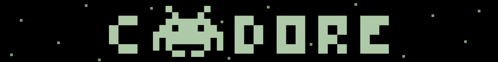

<div align="center">

[](https://github.com/mzpkdev/cmdore/blob/master/LICENSE)
[](https://www.npmjs.com/package/cmdore)
[](https://www.typescriptlang.org/)
[](https://bundlephobia.com/result?p=cmdore)

</div>
<br>
<br>

<p align="center">
  
  <p align="center">
    <strong>cmdore</strong> is a lightweight, type-safe, and composable CLI framework <br>  
      — designed for modern TypeScript applications
    <br />
    <br />
    <a href="#how-to-use"><strong>Explore the API »</strong></a>
    <br />
    <br />
    <a href="https://github.com/mzpkdev/cmdore/issues">Report a bug</a>
    &nbsp;&nbsp;·&nbsp;&nbsp;
    <a href="https://github.com/mzpkdev/cmdore/issues">Request a feature</a>
    &nbsp;&nbsp;·&nbsp;&nbsp;
    <a href="./README_ZH.md">中文</a>
  </p>
<br />
<br />

## Table of Contents

- [Overview](#overview)
  - [Why cmdore?](#why-cmdore)
  - [Key Features](#key-features)
- [Getting started](#getting-started)
  - [How to install](#how-to-install)
  - [How to use](#how-to-use)
  - [How to validate & coerce](#how-to-validate--coerce)
  - [Using with a schema library (Standard Schema)](#using-with-a-schema-library-standard-schema)
  - [Interceptors](#interceptors)
  - [How --quiet & --verbose works](#how---quiet----verbose-works)
  - [How --dry-run works](#how---dry-run-works)
  - [How --json works](#how---json-works)

## Overview

### Why cmdore?

cmdore is a modern CLI framework that stands out with its perfect balance of simplicity, type safety, and flexibility.
Unlike other CLI frameworks that are either too minimal or too opinionated, cmdore provides:

- **True TypeScript-first design**: Built from the ground up with TypeScript, offering complete type safety and
  excellent IDE integration
- **Composable architecture**: Define commands and options in separate modules for maximum reusability
- **Minimal dependencies**: Extremely lightweight with only two small dependencies
- **Developer-friendly API**: Intuitive API that feels natural to TypeScript developers
- **Progressive complexity**: Simple for basic use cases, but scales to complex CLI applications

### Key Features

- **Advanced Type Safety**: Enjoy full type inference for commands, options, and arguments with zero type assertions
  needed
- **Modular Command Structure**: Create reusable command and option modules that can be shared across your application
- **Smart Output Control**: Built-in support for quiet, verbose, JSON, and dry-run modes with minimal code
- **Interactive Prompts**: Easily create interactive CLI experiences with built-in prompt utilities
- **Automatic Help Generation**: Beautiful, automatically generated help text for all commands
- **Powerful Validation**: Validate and transform command arguments with any
  [Standard Schema](https://standardschema.dev) (Zod, Valibot, ArkType, …) — no adapters
- **Minimal Bundle Size**: Extremely small footprint with just two lightweight dependencies
- **Interceptors**: Add cross-cutting concerns like authentication or logging across multiple commands
- **Structured Error Handling**: Consistent error handling for validation and runtime errors
- **Zero Configuration**: Works out of the box with sensible defaults, but fully customizable

## Getting started

### How to install

```shell
npm install cmdore
```

### How to use

Define your commands and hand them to `execute` — the single entry point. There is no `Program` class to instantiate and
nothing to `.register()`: `execute(commands, config)` takes a list of commands and a `config` (its `metadata` — program
name and description, with version optional — is required), parses `process.argv` (by default), dispatches to the
matching command, and renders help/version itself.

> [!NOTE] **The raw value of an option is shaped by its `arity` — and the types say so.** With no `schema`, cmdore hands
> you the unparsed value:
>
> ```typescript
> { name: "tags" }              // arity ∞ (default) → string[]   e.g. --tags a b → ["a", "b"]
> { name: "host", arity: 1 }    // arity 1           → string     e.g. --host x   → "x"
> { name: "force", arity: 0 }   // arity 0           → boolean    present → true, absent → false
> ```
>
> An `arity: 0` option is a boolean flag: its value is `true` when the flag is present and `false` when it is absent —
> it is typed `boolean` (never `undefined`). Every other option that is **not** `required` and has **no** `defaultValue`
> is typed with `| undefined`, because it may be omitted. If a `defaultValue` is present (and no `schema`), the option
> takes that function's return type.
>
> To validate or coerce a value into any shape, attach a `schema` — any [Standard Schema](https://standardschema.dev).
> cmdore infers `argv.<name>` from the schema's output type:
>
> ```typescript
> { name: "port", arity: 1, schema: portNumberSchema }  // → number (whatever the schema outputs)
> ```
>
> The value handed to the schema is the same arity-shaped raw value: a `string` for `arity: 1`, a `string[]` for a
> variadic (default-arity) option. Arguments work the same way — a scalar argument receives a `string`, a
> `variadic: true` argument receives a `string[]`.
>
> Inline option objects (inside a `defineCommand({ options: [...] })`) are typed precisely on their own — the
> `defineOption` wrapper is optional and only needed when you want to define a reusable, named option. (It also rejects
> unknown fields, so a typo is a compile error.) See [How to validate & coerce](#how-to-validate--coerce) for the full
> story.

#### 🎮 Basic Command

Start your Space Defender mission with a simple command:

```typescript
import { execute, defineCommand } from "cmdore"

const startMission = defineCommand({
  name: "start-mission",
  description: "Launch your Space Defender spacecraft",
  options: [
    { name: "pilot", arity: 1, description: "Pilot callsign" },
    { name: "difficulty", arity: 1, description: "Mission difficulty" }
  ],
  run: ({ pilot, difficulty }) => {
    console.log(`Attention ${pilot ?? "Cadet"}! Launching spacecraft in ${difficulty ?? "Standard"} difficulty.`)
    console.log(`Prepare to defend Earth from the alien invasion!`)
  }
})

// `execute` parses process.argv by default; pass `{ argv }` to override.
// `metadata` is required — it names the program in help/version output.
execute([ startMission ], {
  metadata: { name: "space-defender", version: "1.0.0", description: "Defend Earth from the alien invasion" }
})
```

#### 🕹️ Helper Functions

Configure your spacecraft systems before engaging the alien fleet. `defineCommand`, `defineOption`, and `defineArgument`
are optional helpers that name a reusable definition and reject unknown fields:

```typescript
import { execute, defineCommand, defineOption } from "cmdore"

const configureShipCommand = defineCommand({
  name: "configure-ship",
  description: "Prepare your spacecraft for the upcoming battle",
  examples: [
    "--weapons photon-torpedoes --shield quantum"
  ],
  options: [
    defineOption({
      name: "weapons",
      description: "Weapon system to equip",
      alias: "w",
      arity: 1,
      required: true
    }),
    defineOption({
      name: "shield",
      description: "Shield technology to deploy",
      alias: "s",
      arity: 1,
      required: true
    })
  ],
  run: ({ weapons, shield }) => {
    console.log(`Arming spacecraft with ${weapons} weapon systems`)
    console.log(`Activating ${shield} shields at maximum capacity`)
    console.log(`All systems ready. Prepare for alien encounter!`)
  }
})

execute([ configureShipCommand ], {
  metadata: { name: "space-defender", version: "1.0.0", description: "Defend Earth from the alien invasion" }
})
```

### Commandless mode

Some tools are a single command — they take arguments directly, with no subcommand to choose. `execute` covers this by
overloading on what you hand it:

- `execute(cli)` — pass a **single** command → a **commandless** CLI, invoked as `mytool <args> [options]` (no
  subcommand token).
- `execute([cli])` — pass an **array** → the existing **git-style** CLI, invoked as `mytool <command> <args> [options]`.

In commandless mode the command's `name` is cosmetic — it is a label for help output and is never matched against
`process.argv`. The very same command definition can be wired either way.

```typescript
import { execute, defineCommand, terminal } from "cmdore"

const greet = defineCommand({
  name: "greet",
  description: "Print a friendly greeting",
  arguments: [
    { name: "name", required: true }
  ],
  options: [
    { name: "loud", alias: "l", arity: 0, description: "Shout the greeting" }
  ],
  run: ({ name, loud }) => {
    const greeting = `Hello, ${name}!`
    terminal.log(loud ? greeting.toUpperCase() : greeting)
  }
})

// Single command — the commandless form. Invoked as `greet <name> [options]`.
execute(greet, {
  metadata: { name: "greet", version: "1.0.0", description: "Print a friendly greeting" }
})
```

The generated help shows the program name once — there is no subcommand to render, so the usage line is
`greet <name> [options]`, not a doubled `greet greet ...`:

```
greet - Print a friendly greeting

USAGE
  greet <name> [options]

ARGUMENTS
  <name>                                            (required)

OPTIONS
  -l, --loud                                        Shout the greeting
      --quiet                                       suppress any output
      --verbose                                     enable verbose output
      --json                                        enable JSON output
      --dry-run                                     simulate the command without executing anything
      --no-colors                                   disable colored output
  -v, --version                                     show version
  -h, --help                                        show information for program or the command
```

### How to validate & coerce

Validation and coercion go through one field: `schema`. (There is no `validate` or `parse` field on an option or
argument — `schema` is the single hook.) It accepts any value that implements the
[Standard Schema](https://standardschema.dev) `~standard` contract. You can hand-roll one (it is only a few lines) or
use any compliant library. A schema's `~standard.validate` returns either `{ value }` on success or
`{ issues: [{ message }] }` on failure (the presence of `issues` is the failure signal); cmdore joins the issue messages
and throws a `CmdoreError`. `validate` may be async — cmdore awaits it.

cmdore infers `argv.<name>` from the schema's **output** type. The value handed to the schema is always the arity-shaped
raw input: a `string` for an `arity: 1` option or a scalar argument, a `string[]` for a variadic (default-arity) option
or a `variadic: true` argument.

For the common scalar case, `coerce` is a lightweight shorthand: a `(raw: string, ctx: CoerceContext) => T` that runs at
parse time on an `arity: 1` option (or a non-variadic argument). Its return becomes the value **and** flows into the
typed `argv`; if it throws, cmdore turns that into a usage error (a `CmdoreError` with `exitCode: 2`, exactly like a
schema failure). Use it instead of `schema` when you just need to turn a string into a scalar — no Standard Schema
required.

The second argument is a `CoerceContext` — `{ name, label }` where `label` is the **canonical** display form: `--<name>`
for an option, the bare `<name>` for a positional argument. Reach for it to build a message without hard-coding the
flag, so one coercer is reusable across flags. (A 1-arg `coerce: (s) => …` stays valid; the second argument is
optional.)

```typescript
import type { CoerceContext } from "cmdore"

// argv.line is typed `number | undefined`
{ name: "line", arity: 1, coerce: (s, { label }: CoerceContext) => {
  const n = Number(s)
  if (!Number.isInteger(n)) throw new Error(`${label} must be an integer, got '${s}'`)
  return n
} }
```

Scan for alien vessels in the sector and validate their threat level:

```typescript
import { defineCommand, defineOption, type StandardSchemaV1 } from "cmdore"

// A hand-rolled Standard Schema — no dependency required.
const powerSchema: StandardSchemaV1<number> = {
  "~standard": {
    version: 1,
    vendor: "space-defender",
    validate: (value) => {
      const power = parseFloat(String(value))
      if (isNaN(power) || power < 1.0 || power > 10.0) {
        return { issues: [{ message: "Scanner power must be between 1.0 and 10.0." }] }
      }
      return { value: power }
    }
  }
}

const coordinatesSchema: StandardSchemaV1<number[]> = {
  "~standard": {
    version: 1,
    vendor: "space-defender",
    validate: (value) => ({
      value: String(value).split(",").map((coord) => parseInt(coord.trim(), 10))
    })
  }
}

const scanSectorCommand = defineCommand({
  name: "scan-sector",
  description: "Scan space sector for alien activity",
  options: [
    defineOption({
      name: "power",
      description: "Scanner power level (must be between 1.0 and 10.0)",
      alias: "p",
      arity: 1,
      schema: powerSchema
    }),
    defineOption({
      name: "coordinates",
      description: "Sector coordinates (comma-separated: x,y)",
      alias: "c",
      arity: 1,
      schema: coordinatesSchema
    })
  ],
  run: ({ power, coordinates }) => {
    // power and coordinates are optional — guard before reading them
    if (power == null || coordinates == null) {
      console.log("Provide both --power and --coordinates to scan.")
      return
    }
    console.log(`Activating long-range scanners at ${power} power level`)
    console.log(`Scanning sector: X=${coordinates[0]}, Y=${coordinates[1]}`)
    console.log(`Alert! Detected ${Math.floor(power * 2)} alien vessels approaching!`)
  }
})
```

### Using with a schema library (Standard Schema)

cmdore vendors the [Standard Schema](https://standardschema.dev) interface and carries **zero schema-library
dependency** — you bring your own validator. `schema` accepts any Standard Schema, with no adapters and no plugins.
Modern **Zod** (v3.24+), **Valibot** (v1.0+), and **ArkType** (v2.0+) implement the `~standard` contract natively, so
you can pass a schema straight through:

```typescript
import { z } from "zod"
import { execute, defineCommand, defineOption, defineArgument } from "cmdore"

const deployCommand = defineCommand({
  name: "deploy",
  description: "Deploy to target environment",
  arguments: [
    defineArgument({
      name: "environment",
      required: true,
      schema: z.enum(["staging", "production"])
    })
  ],
  options: [
    defineOption({
      name: "port",
      description: "Port number (1-65535)",
      hint: "number",
      arity: 1,
      defaultValue: () => 3000,
      // the incoming value is a string — z.coerce.number() is the string→number path
      schema: z.coerce.number().int().min(1).max(65535)
    }),
    defineOption({
      name: "replicas",
      description: "Number of replicas",
      hint: "count",
      arity: 1,
      schema: z.coerce.number().positive()
    })
  ],
  run: ({ environment, port, replicas }) => {
    // argv.port is `number` (defaulted), argv.replicas is `number | undefined`,
    // argv.environment is "staging" | "production"
    console.log(`Deploying to ${environment} on port ${port} with ${replicas} replicas`)
  }
})
```

cmdore infers `argv.<name>` from the schema's output type, calls the schema's `~standard.validate` (awaiting it if it is
async), and throws a `CmdoreError` carrying the issue messages on failure.

> [!NOTE] The value cmdore hands a schema is always a **string** (for `arity: 1` options and scalar arguments) or a
> **`string[]`** (for variadic). Because the input is a string, use the coercing variants for numbers:
> `z.coerce.number()` turns `"8080"` into `8080`, whereas a bare `z.number()` **rejects** `"8080"` (it never sees a
> `number`).

> [!NOTE] Not every library is natively Standard Schema. **TypeBox is not** — a raw `Type.Number()` is not `~standard`
> and will not type-check as a `schema`. Wrap it with [`@sinclair/typemap`](https://github.com/sinclairzx81/typemap)'s
> `StandardSchema(...)` first:
>
> ```typescript
> import { Type } from "@sinclair/typebox"
> import { StandardSchema } from "@sinclair/typemap"
>
> // schema: Type.Number()                  // ✗ not a Standard Schema
> schema: StandardSchema(Type.Number())      // ✓ wrapped
> ```

### Interceptors

Interceptors run cross-cutting logic (auth, logging, setup) before a command's `run`. `intercept` is a standalone helper
— `intercept(dependencies, handler)` — that returns an `Interceptor`. The `dependencies` are the options the interceptor
reads; `argv` inside the handler is typed from them, and the interceptor only fires when every dependency is present on
the dispatched command. Register them through `execute`'s `interceptors` config:

```typescript
import { execute, intercept, defineCommand, defineOption } from "cmdore"

const verbose = defineOption({ name: "verbose", arity: 0 })

const deploy = defineCommand({
  name: "deploy",
  options: [ verbose ],
  run: ({ verbose }) => {
    console.log(`deploying (verbose=${verbose})`)
  }
})

execute([ deploy ], {
  metadata: { name: "deploy", version: "1.0.0", description: "Deploy a service" },
  interceptors: [
    intercept([ verbose ], (argv) => {
      // argv.verbose is typed `boolean` (arity 0)
      if (argv.verbose) {
        console.log("verbose mode on")
      }
    })
  ]
})
```

> [!NOTE] `--verbose`, `--quiet`, `--json`, `--dry-run`, `--no-colors`, `-h`/`--help`, and — when `metadata.version` is
> set — `-v`/`--version` are built-in flags handled by `execute` itself — you do not declare or call them. (Declaring an
> option named `verbose`, as above, just lets an interceptor read the flag's value.) Help and version output is rendered
> by `execute`; there are no `.help()` or `.version()` methods to call.

### How --quiet & --verbose works

Monitor your spacecraft systems during the heat of battle:

```typescript
import { terminal, defineCommand, defineOption } from "cmdore"

const shipStatusCommand = defineCommand({
  name: "ship-status",
  description: "Check spacecraft systems during combat",
  options: [
    defineOption({
      name: "system-name",
      description: "Name of the ship system to check",
      alias: "s",
      arity: 1,
      required: true
    })
  ],
  run: ({ "system-name": systemName }) => {
    // Only shown with --verbose flag
    terminal.verbose("Initiating deep system diagnostic scan...")
    terminal.verbose(`Analyzing ${systemName} subsystem components...`)

    // Standard output (hidden with --quiet flag)
    terminal.log(`${systemName} system diagnostic initiated`)
    terminal.log("Primary functions operational")

    // Warning message (hidden with --quiet flag)
    terminal.warn("Warning: Enemy fire causing power fluctuations in forward shields")

    // Error message (always shown, even with --quiet flag)
    terminal.error("CRITICAL: Warp core containment field unstable after direct hit!")

    terminal.log("Rerouting emergency power. Prepare for evasive maneuvers!")
  }
})
```

### How --dry-run works

Navigate through an asteroid field while engaging alien fighters:

```typescript
import { effect, terminal, defineCommand, defineOption } from "cmdore"

const navigateAsteroidFieldCommand = defineCommand({
  name: "navigate-asteroids",
  description: "Pilot through dangerous asteroid field while engaging enemies",
  options: [
    defineOption({
      name: "maneuver",
      description: "Flight maneuver pattern to use",
      alias: "m",
      arity: 1,
      defaultValue: () => "evasive-delta"
    })
  ],
  run: async ({ maneuver }) => {
    // Verbose messages only appear when --verbose flag is used
    terminal.verbose(`Calculating optimal trajectory using ${maneuver} pattern...`)
    terminal.verbose(`Scanning asteroid density and alien fighter positions...`)

    // Regular output
    terminal.log(`Initiating ${maneuver} maneuver through asteroid field...`)
    terminal.log(`Alien fighters detected on intercept course!`)

    // Interactive prompt
    const confirm = await terminal.prompt(
      `Engage auto-targeting system for alien fighters? (y/n): `,
      { parser: value => value.toLowerCase() === "y" }
    )

    if (!confirm) {
      terminal.log("Auto-targeting disengaged. Manual targeting mode active.")
    } else {
      terminal.log("Auto-targeting engaged! Locking on to alien fighters.")
    }

    // The effect() function skips execution when --dry-run is used
    await effect(async () => {
      terminal.warn("Warning: Shield integrity at 50% after asteroid impact!")
      await reroute_power_to_shields()
      terminal.log("Shields reinforced. Continuing mission.")
    })

    terminal.log("Asteroid field successfully navigated. Alien fighters destroyed!")
  }
})
```

### How --json works

After the battle, generate a mission report for Space Command HQ:

```typescript
import { defineCommand, defineOption } from "cmdore"

const missionReportCommand = defineCommand({
  name: "mission-report",
  description: "Generate battle performance report for Space Command",
  options: [
    defineOption({
      name: "battle-id",
      description: "Battle identifier code",
      arity: 1,
      required: true
    })
  ],
  run: ({ "battle-id": battleId }) => {
    console.log(`Generating mission report for Battle: ${battleId}`)
    console.log("Transmitting data to Space Command HQ...")

    // Return structured data that will be:
    // - Formatted as a table in normal mode
    // - Output as JSON when using --json flag
    return [
      { system: "weapons", status: "operational", efficiency: "92%", notes: "Photon torpedoes depleted" },
      { system: "shields", status: "damaged", efficiency: "63%", notes: "Requires repair at starbase" },
      { system: "engines", status: "operational", efficiency: "87%", notes: "Minor fluctuations detected" },
      { system: "life_support", status: "operational", efficiency: "100%", notes: "All crew safe" },
      { system: "alien_kills", status: "success", efficiency: "27 ships", notes: "New squadron record!" }
    ]
  }
})
```
